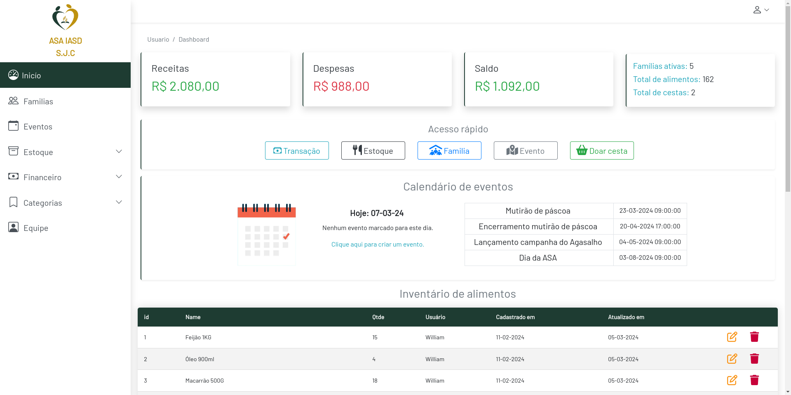

## 
ASA IASD - Controle de estoque e financeiro

:heavy_exclamation_mark: Projeto ainda em fase de desenvolvimento :exclamation:

Projeto feito com:
 - HTML, CSS, Bootstrap, JS + PHP + SLIM Framework + Plates Engine + MySQL 

O Intuito do projeto é criar uma aplicação web para controle financeiro pessoal e para amigos.
___

# Tela de login

&nbsp;
___
# Dashboard Principal

&nbsp;
___
# Fluxos da Aplicação

### Fluxo de login e validação
Agora será mostrado como está o projeto no momento.

&nbsp;

### Fluxo da Dashboard principal
Na dashboard principal há um core de features essenciais que são utilizadas através de modais.

&nbsp;

### Instalação
- Clone este repositorio atráves do terminal, VS Code

## Autor

> William Silva -> [Site e portfolio pessoal](https://bywilliams.github.io/portfolio/)

**Agradeço por terem acompanhdo a documentação e a explicação deste pequeno projeto, e trarei mais projetos.**
